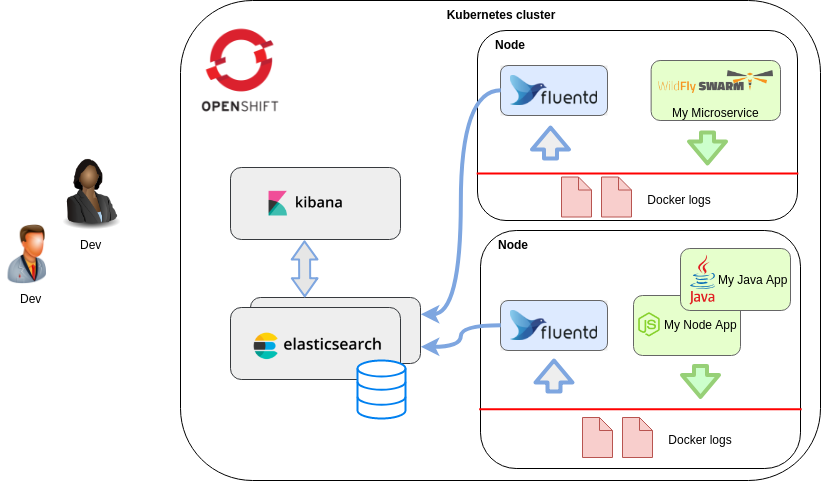
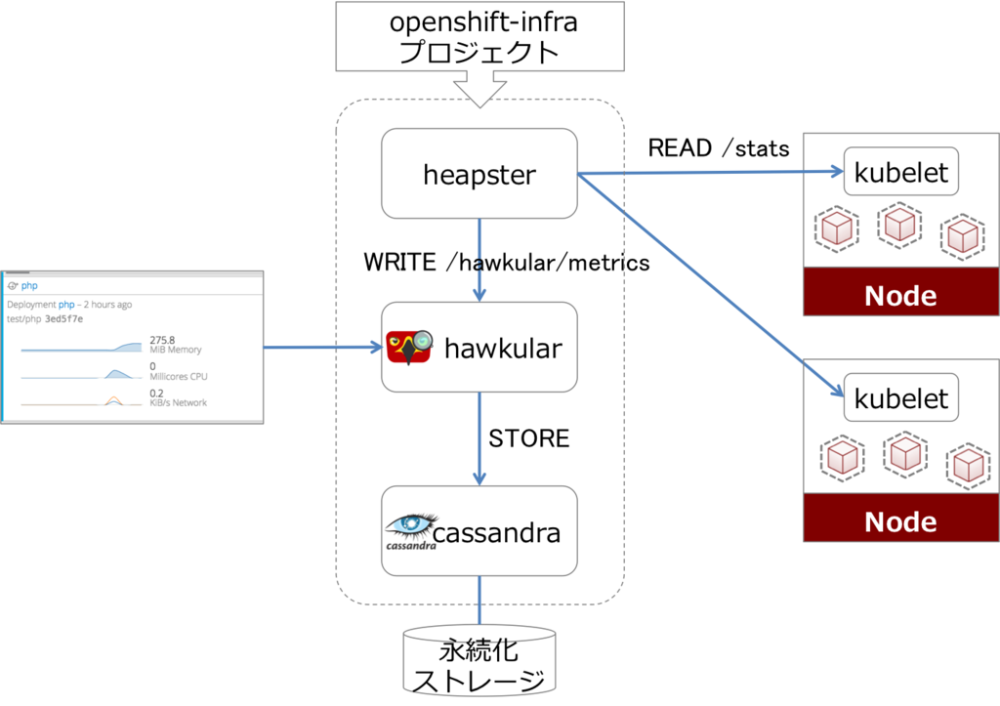
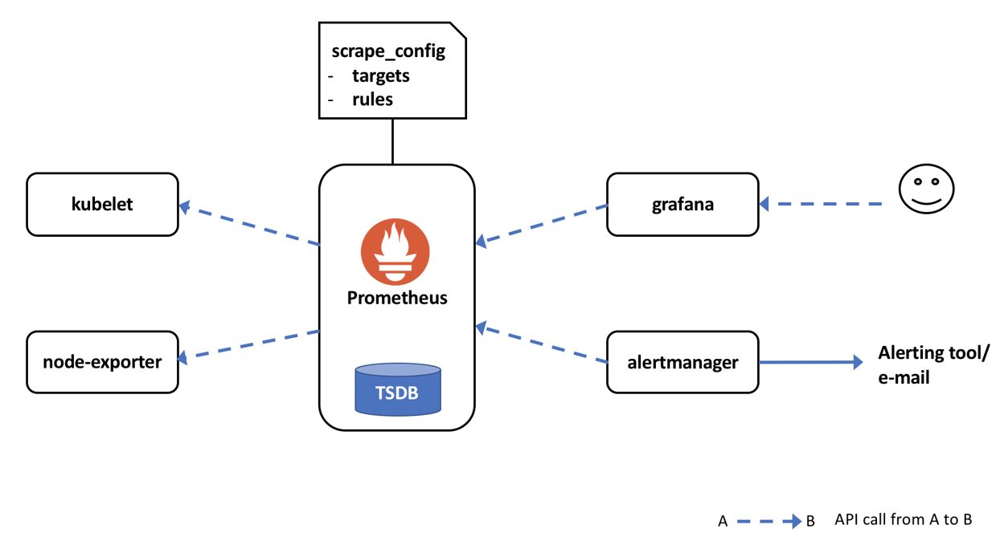

# openshift-workshop

## Project Title

Day 2 Operations for Openshift 3

## Disclaimer

**This is a reference manual for day 2 operations on Openshift 3 for didactic use only so it is not expected to use it for production environments.** 
**Please use the latest official documentation instead for production usage. Changes in the procedures can appear on each specific release.**

https://docs.openshift.com/container-platform/3.11/welcome/index.html   

<br><br><br>
## Openshift 3 Architecture

The following workshop applies for a test Red Hat Openshift Container Platform  3.11 cluster using OCS 3.11 with gluster in independent mode.
Red Hat OpenShift Container Platform is a container application platform based on Red Hat Enterprise Linux, containers, and Kubernetes:

* Allows developers to focus on source code and rely on the container platform infrastructure to build and deploy containers to run applications.

* Employs master servers that manage node servers that run applications as containers.

* Provides additional authentication, security, scheduling, networking, storage, logging, metrics, and application life-cycle management over default Kubernetes features.

* Provides built-in high availability (HA) for masters and pods.

  

```bash
$ oc get nodes -o wide
NAME             STATUS    ROLES           AGE       VERSION           INTERNAL-IP   EXTERNAL-IP   OS-IMAGE       KERNEL-VERSION               CONTAINER-RUNTIME
srv01.info.net   Ready     master          21h       v1.11.0+d4cacc0   10.0.92.35    <none>        Employee SKU   3.10.0-1062.9.1.el7.x86_64   docker://1.13.1
srv02.info.net   Ready     master          21h       v1.11.0+d4cacc0   10.0.92.34    <none>        Employee SKU   3.10.0-1062.9.1.el7.x86_64   docker://1.13.1
srv03.info.net   Ready     master          21h       v1.11.0+d4cacc0   10.0.91.115   <none>        Employee SKU   3.10.0-1062.9.1.el7.x86_64   docker://1.13.1
srv07.info.net   Ready     compute         20h       v1.11.0+d4cacc0   10.0.91.54    <none>        Employee SKU   3.10.0-1062.9.1.el7.x86_64   docker://1.13.1
srv08.info.net   Ready     compute         20h       v1.11.0+d4cacc0   10.0.92.13    <none>        Employee SKU   3.10.0-1062.9.1.el7.x86_64   docker://1.13.1
srv09.info.net   Ready     compute         20h       v1.11.0+d4cacc0   10.0.92.1     <none>        Employee SKU   3.10.0-1062.9.1.el7.x86_64   docker://1.13.1
srv10.info.net   Ready     infra,ingress   20h       v1.11.0+d4cacc0   10.0.91.117   <none>        Employee SKU   3.10.0-1062.9.1.el7.x86_64   docker://1.13.1
srv11.info.net   Ready     infra,ingress   20h       v1.11.0+d4cacc0   10.0.91.79    <none>        Employee SKU   3.10.0-1062.9.1.el7.x86_64   docker://1.13.1
srv12.info.net   Ready     infra,ingress   20h       v1.11.0+d4cacc0   10.0.91.56    <none>        Employee SKU   3.10.0-1062.9.1.el7.x86_64   docker://1.13.1
srv13.info.net   Ready     infra,ingress   20h       v1.11.0+d4cacc0   10.0.91.113   <none>        Employee SKU   3.10.0-1062.9.1.el7.x86_64   docker://1.13.1
srv14.info.net   Ready     infra,ingress   20h       v1.11.0+d4cacc0   10.0.92.58    <none>        Employee SKU   3.10.0-1062.9.1.el7.x86_64   docker://1.13.1

$ oc get pods -n default -o wide
NAME                       READY     STATUS    RESTARTS   AGE       IP            NODE             NOMINATED NODE
docker-registry-1-8kckj    1/1       Running   0          20h       10.254.10.3   srv11.info.net   <none>
registry-console-1-6c9zp   1/1       Running   0          20h       10.254.2.7    srv02.info.net   <none>
router-apps-1-95fsf        1/1       Running   0          20h       10.0.91.79    srv11.info.net   <none>
router-apps-1-h79gd        1/1       Running   0          20h       10.0.91.113   srv13.info.net   <none>
router-shop-1-lct4p        1/1       Running   0          20h       10.0.91.113   srv13.info.net   <none>
router-shop-1-pqq88        1/1       Running   0          20h       10.0.92.58    srv14.info.net   <none>

$ oc get sc
NAME                          PROVISIONER                          AGE
glusterfs-storage (default)   kubernetes.io/glusterfs              20h
glusterfs-storage-block       gluster.org/glusterblock-glusterfs   20h
```


<br><br><br>
## Openshift 3 Upgrade

### Official Documentation

https://docs.openshift.com/container-platform/3.11/upgrading/index.html#install-config-upgrading-strategy-inplace

* Make sure that you have a full backup of the cluster before upgrading it.


* Check Openshift version Before upgrade.

```bash
$ curl -k https://srv01.info.net:443/version
{
  "major": "1",
  "minor": "11+",
  "gitVersion": "v1.11.0+d4cacc0",
  "gitCommit": "d4cacc0",
  "gitTreeState": "clean",
  "buildDate": "2019-12-02T08:30:15Z",
  "goVersion": "go1.10.8",
  "compiler": "gc",
  "platform": "linux/amd64"
}

$ oc get -n default dc/docker-registry -o json | grep \"image\"
"image": "registry.redhat.io/openshift3/ose-docker-registry:v3.11.157", 

$ oc get -n default dc/router-apps -o json | grep \"image\"
"image": "registry.redhat.io/openshift3/ose-haproxy-router:v3.11.157",
```

* On bastion node update ansible playbooks to the desired version that we want to upgrade (latest) on bastion host.

```bash
$ yum update -y openshift-ansible
$ rpm -q openshift-ansible
openshift-ansible-3.11.161-2.git.5.029d67f.el7.noarch
```

* On bastion node modify cluster inventory in order to reflect the new package and image versions.

```bash
$ cat hosts
openshift_pkg_version="-3.11.157"
openshift_image_tag="v3.11.157"
...
openshift_metrics_image_version=v3.11.157
openshift_logging_image_version=v3.11.157
openshift_service_catalog_image_version=v3.11.157
...
openshift_web_console_version="v3.11.157"
openshift_console_image_name=registry.redhat.io/openshift3/ose-console:v3.11.157
```

Change 3.11.157 to 3.11.161


* On bastion node export ansible inventory file updated that matches the Openshift cluster.

```bash
$ export INVENTORY=/path/to/hosts_upgrade
```

* **If using external gluster cluster provisioned during the install**, comment that nodes from the inventory used to upgrade the cluster:

```bash
[glusterfs]
### IND MODE
#srv04.info.net glusterfs_ip=10.0.91.52  glusterfs_devices='[ "/dev/vdb" ]' glusterfs_zone=1
#srv05.info.net glusterfs_ip=10.0.91.45  glusterfs_devices='[ "/dev/vdb" ]' glusterfs_zone=1
#srv06.info.net glusterfs_ip=10.0.91.116 glusterfs_devices='[ "/dev/vdb" ]' glusterfs_zone=1
```

* Check that all cluster nodes have attached only the required rpm chanels.

```bash
rhel-7-server-ansible-2.6-rpms/x86_64
rhel-7-server-extras-rpms/x86_64
rhel-7-server-ose-3.11-rpms/x86_64
rhel-7-server-rpms/7Server/x86_64         
```

```bash
$ ansible all -i ${INVENTORY} -m shell -a 'yum clean all && yum repolist'
```

*  From bastion node validate OpenShift Container Platform storage migration to ensure potential issues are resolved before the outage window.

```bash
master$ oc adm migrate storage --include=* --loglevel=2 --confirm --config /etc/origin/master/admin.kubeconfig
```

* From bastion node upgrade the control plane.

```bash
$ cd /usr/share/ansible/openshift-ansible && ansible-playbook -i ${INVENTORY} playbooks/byo/openshift-cluster/upgrades/v3_11/upgrade_control_plane.yml
```

* From bastion node upgrade worker nodes.

```bash
$ cd /usr/share/ansible/openshift-ansible && ansible-playbook -i ${INVENTORY} playbooks/byo/openshift-cluster/upgrades/v3_11/upgrade_nodes.yml -e openshift_upgrade_nodes_label="node-role.kubernetes.io/compute=true"
```

* From bastion node upgrade infra nodes.

```bash
$ cd /usr/share/ansible/openshift-ansible && ansible-playbook -i ${INVENTORY} playbooks/byo/openshift-cluster/upgrades/v3_11/upgrade_nodes.yml -e openshift_upgrade_nodes_label="node-role.kubernetes.io/infra=true"
```

* Quick upgrade verify.

```bash
$ oc get nodes
$ oc get pods -n kube-system
$ oc get pods --all-namespaces
$ oc get pvc --all-namespaces
$ oc get pv
$ oc get -n default dc/docker-registry -o json | grep \"image\"
    "image": "openshift3/ose-docker-registry:v3.11.117",
$ oc get -n default dc/router -o json | grep \"image\"
    "image": "openshift3/ose-haproxy-router:v3.11.117",
```

* Run Openshift 3 HealthCheck procedure (see next section).


<br><br><br>
## Openshift 3 HealthCheck

### Official Documentation

https://docs.openshift.com/container-platform/3.11/day_two_guide/environment_health_checks.html
https://docs.openshift.com/container-platform/3.11/admin_guide/diagnostics_tool.html
https://access.redhat.com/documentation/en-us/openshift_container_platform/3.11/html-single/day_two_operations_guide/#day-two-guide-network-connectivity

### Ansible-based Health Checks

Health checks are available through the Ansible-based tooling used to install and manage OpenShift Container Platform clusters. They can report common deployment problems for the current OpenShift Container Platform installation.

```bash
$ cd /usr/share/ansible/openshift-ansible && ansible-playbook -i hosts -e openshift_disable_check=curator,elasticsearch,logging_index_time,diagnostics playbooks/openshift-checks/health.yml
```

### Checking complete environment health - Deploy test app

```bash
$ oc new-project httpd-test
$ oc new-app --image-stream=httpd-24-rhel7
$ oc expose service httpd-24-rhel7
$ oc create route edge httpd-24-rhel7-ssl --service=httpd-24-rhel7 --hostname=httpd-24-rhel7-ssl-httpd-test.apps.info.net
$ oc get pods
$ oc get svc
$ oc get route

$ curl httpd-24-rhel7-httpd-test.apps.info.net
$ curl -k httpd-24-rhel7-httpd-test.apps.info.net
$ firefox httpd-24-rhel7-httpd-test.apps.info.net

$ oc delete project httpd-test
```

### Host health

```bash
master$ oc get nodes
master$ oc get pod --all-namespaces -o wide

master$ source /etc/etcd/etcd.conf
master$ etcdctl --cert-file=$ETCD_PEER_CERT_FILE --key-file=$ETCD_PEER_KEY_FILE \
  --ca-file=/etc/etcd/ca.crt --endpoints=$ETCD_LISTEN_CLIENT_URLS cluster-health
master$ etcdctl --cert-file=$ETCD_PEER_CERT_FILE --key-file=$ETCD_PEER_KEY_FILE \
  --ca-file=/etc/etcd/ca.crt --endpoints=$ETCD_LISTEN_CLIENT_URLS member list
```


### Router and registry health

```bash
$ oc -n default get deploymentconfigs/router
NAME      REVISION   DESIRED   CURRENT   TRIGGERED BY
router    1          3         3         config


$ oc -n default get deploymentconfigs/docker-registry
NAME              REVISION   DESIRED   CURRENT   TRIGGERED BY
docker-registry   1          3         3         config

* The values in the DESIRED and CURRENT columns should match the number of nodes hosts *
```

### Network connectivity

#### Connectivity on master hosts

Master services keep their state synchronized using the etcd key-value store. This communication happens on TCP ports 2379 and 2380.


```bash
$ oc get nodes
...
```
(Ready status means that master hosts can communicate with node hosts and that the nodes are ready to run pods (excluding the nodes in which scheduling is disabled))


#### SkyDNS

SkyDNS provides name resolution of local services running in OpenShift Container Platform. This service uses TCP and UDP port 8053.

```bash
$ dig +short docker-registry.default.svc.cluster.local
172.30.150.7

$ oc get svc/docker-registry -n default
NAME              CLUSTER-IP     EXTERNAL-IP   PORT(S)    AGE
docker-registry   172.30.150.7   <none>        5000/TCP   3d
```

-> 172.30.150.7 equivalent IP match


#### API service and web console

Both the API service and web console share the same port, usually TCP 8443 or 443, depending on the setup. This port needs to be available within the cluster and to everyone who needs to work with the deployed environment.


```bash
$ curl -k https://loadbalancer.2e5b.example.opentlc.com:443/version
{
  "major": "1",
  "minor": "6",
  "gitVersion": "v1.6.1+5115d708d7",
  "gitCommit": "fff65cf",
  "gitTreeState": "clean",
  "buildDate": "2017-10-11T22:44:25Z",
  "goVersion": "go1.7.6",
  "compiler": "gc",
  "platform": "linux/amd64"
}

$ curl -k https://loadbalancer.2e5b.example.opentlc.com:443/healthz
ok
```

#### Connectivity on node instances

The SDN connecting pod communication on nodes uses UDP port 4789 by default. To verify node host functionality, create a new application:

```bash
$ oc new-project sdn-test
$ oc new-app httpd~https://github.com/sclorg/httpd-ex
$ oc get pods

$ oc rsh po/<pod-name>
$ curl -kv https://docker-registry.default.svc.cluster.local:5000/healthz
* About to connect() to docker-registry.default.svc.cluster.locl port 5000 (#0)
*   Trying 172.30.150.7...
* Connected to docker-registry.default.svc.cluster.local (172.30.150.7) port 5000 (#0)
* Initializing NSS with certpath: sql:/etc/pki/nssdb
* skipping SSL peer certificate verification
* SSL connection using TLS_ECDHE_RSA_WITH_AES_128_GCM_SHA256
* Server certificate:
*       subject: CN=172.30.150.7
*       start date: Nov 30 17:21:51 2017 GMT
*       expire date: Nov 30 17:21:52 2019 GMT
*       common name: 172.30.150.7
*       issuer: CN=openshift-signer@1512059618
> GET /healthz HTTP/1.1
> User-Agent: curl/7.29.0
> Host: docker-registry.default.svc.cluster.local:5000
> Accept: */*
>
< HTTP/1.1 200 OK
< Cache-Control: no-cache
< Date: Mon, 04 Dec 2017 16:26:49 GMT
< Content-Length: 0
< Content-Type: text/plain; charset=utf-8
<
* Connection #0 to host docker-registry.default.svc.cluster.local left intact

sh-4.2$ *exit*

```
-> The HTTP/1.1 200 OK response means the node is correctly connecting.

```bash
$ oc delete project sdn-test
project "sdn-test" deleted
```

* To verify the functionality of the routers, check the registry service once more, but this time from outside the cluster:
-> Check external access to SDN

```bash
$ curl -kv https://docker-registry-default.apps.example.com/healthz
*   Trying 35.xx.xx.92...
* TCP_NODELAY set
* Connected to docker-registry-default.apps.example.com (35.xx.xx.92) port 443 (#0)
...
< HTTP/2 200
```

### DNS

Verify wilcard DNS points to LB.

```bash
$ dig *.apps.2e5b.example.opentlc.com
```

Verify all nodes have direct and inverse resolution.

```bash
$ ansible -i hosts all -m shell -a 'host $(hostname); host $(ip a | grep "inet 10." | awk  "{print \$2}" | cut -d/ -f1)' -u quicklab -b
```

### Storage

#### Nodes free space

Master instances need at least 40 GB of hard disk space for the /var directory. Check the disk usage of a master host using the df command:

```bash
$ ansible -i hosts -m shell -a "df -hT"
```

#### Check Heketi OCS status

Run the following script in one master and review the result:

```bash
master$ cat heketi-ocs-status.sh 
#!/bin/bash

STORAGE_PROJECT=$1

subscription-manager repos --enable="rh-gluster-3-client-for-rhel-7-server-rpms"
yum -y install heketi-client
subscription-manager repos --disable="rh-gluster-3-client-for-rhel-7-server-rpms"

oc project ${STORAGE_PROJECT}
export HEKETI_POD=$(oc get pods -l glusterfs=heketi-storage-pod -n ${STORAGE_PROJECT} -o jsonpath="{.items[0].metadata.name}")
export HEKETI_CLI_USER=admin
export HEKETI_CLI_KEY=$(oc get pod/$HEKETI_POD -n ${STORAGE_PROJECT} -o jsonpath='{.spec.containers[0].env[?(@.name=="HEKETI_ADMIN_KEY")].value}')
export HEKETI_ADMIN_KEY_SECRET=$( echo -n ${HEKETI_CLI_KEY} | base64 )
export HEKETI_CLI_SERVER=http://heketi-storage.${STORAGE_PROJECT}.svc:8080
curl -w '\n' ${HEKETI_CLI_SERVER}/hello
sleep 5

heketi-cli topology info
sleep 5

heketi-cli cluster list
heketi-cli node list
heketi-cli volume list
sleep 5

heketi-cli db check
sleep 5

heketi-cli server state examine gluster
sleep 5

master$ heketi-ocs-status.sh glusterfs 
...
``` 

#### Checking the default storage class

For proper functionality of dynamically provisioned persistent storage, the default storage class needs to be defined.

```bash
# oc get storageclass

# oc get sc
NAME                          PROVISIONER                AGE
glusterfs-storage (default)   kubernetes.io/glusterfs    1d
glusterfs-storage-block       gluster.org/glusterblock   1d
```

At least on storage class must be configured as default


#### Checking PVC and PV

Check all PVC are bond to a PV.

```bash
$ oc get pv
$ oc get pvc --all-namespaces
```


#### Checking PVC and use it on APP

```bash
$ oc new-project testme

$ cat pvc.yml
kind: PersistentVolumeClaim
apiVersion: v1
metadata:
 name: claim1
 annotations:
   volume.beta.kubernetes.io/storage-class: glusterfs-storage
spec:
 accessModes:
   - ReadWriteOnce
 resources:
   requests:
     storage: 1Gi

$ oc create -f pvc.yml
$ oc get pvc -> BOUND

$ cat app.yml
apiVersion: v1
kind: Pod
metadata:
 name: busybox
spec:
 containers:
   - image: busybox
     command:
       - sleep
       - "3600"
     name: busybox
     volumeMounts:
       - mountPath: /usr/share/busybox
         name: mypvc
 volumes:
   - name: mypvc
     persistentVolumeClaim:
       claimName: claim1


$ oc create -f app.yml
$ oc describe pod busybox  -> Observe Mount
$ oc get pvc
$ oc get pv
$ oc get events
```

### Docker storage

Docker storage disk is mounted as /var/lib/docker and formatted with xfs file system. Docker storage is configured to use overlay2 filesystem:

```bash
$ ansible -i hosts nodes -m shell -a "cat /etc/sysconfig/docker-storage && docker info"

# docker info
Containers: 4
 Running: 4
 Paused: 0
 Stopped: 0
Images: 4
Server Version: 1.12.6
Storage Driver: overlay2
...
```

### API service status

OpenShift API service runs on all master instances. To see the status of the service, view the master-api pods in the kube-system project:

```bash
$ oc get pod -n kube-system -l openshift.io/component=api
NAME                             READY     STATUS    RESTARTS   AGE
master-api-myserver.com          1/1       Running   0          56d
```

API service exposes a health check, which can be queried externally using the API host name:

```bash
$ oc get pod -n kube-system -o wide
NAME                                               READY     STATUS    RESTARTS   AGE       IP            NODE
master-api-myserver.com                            1/1       Running   0          7h        10.240.0.16   myserver.com/healthz

$ curl -k https://myserver.com/healthz
ok
```

### Controller role verification

OpenShift Container Platform controller service, is available across all master hosts. The service runs in active/passive mode, meaning it should only be running on one master at any time.
  Verify the master host running the controller service as a cluster-admin user:


```bash
$ oc get -n kube-system cm openshift-master-controllers -o yaml
apiVersion: v1
kind: ConfigMap
metadata:
  annotations:
    control-plane.alpha.kubernetes.io/leader: '{"holderIdentity":"master-ose-master-0.example.com-10.19.115.212-dnwrtcl4","leaseDurationSeconds":15,"acquireTime":"2018-02-17T18:16:54Z","renewTime":"2018-02-19T13:50:33Z","leaderTransitions":16}'
  creationTimestamp: 2018-02-02T10:30:04Z
  name: openshift-master-controllers
  namespace: kube-system
  resourceVersion: "17349662"
  selfLink: /api/v1/namespaces/kube-system/configmaps/openshift-master-controllers
  uid: 08636843-0804-11e8-8580-fa163eb934f0
```

The command outputs the current master controller in the control-plane.alpha.kubernetes.io/leader annotation, within the holderIdentity property as:

master-<hostname>-<ip>-<8_random_characters>


Find the hostname of the master host by filtering the output using the following:

```bash
$ oc get -n kube-system cm openshift-master-controllers -o json | jq -r '.metadata.annotations[] | fromjson.holderIdentity | match("^master-(.*)-[0-9.]*-[0-9a-z]{8}$") | .captures[0].string'
```

### Verifying correct Maximum Transmission Unit (MTU) size

Verifying the maximum transmission unit (MTU) prevents a possible networking misconfiguration that can masquerade as an SSL certificate issue.

When a packet is larger than the MTU size that is transmitted over HTTP, the physical network router is able to break the packet into multiple packets to transmit the data.
However, when a packet is larger than the MTU size is that transmitted over HTTPS, the router is forced to drop the packet.

Installation produces certificates that provide secure connections to multiple components that include:

* master hosts
* node hosts
* infrastructure nodes
* registry
* router

These certificates can be found within the /etc/origin/master directory for the master nodes and /etc/origin/node directory for the infra and app nodes.

```bash
$ oc -n default get dc docker-registry -o jsonpath='{.spec.template.spec.containers[].env[?(@.name=="REGISTRY_OPENSHIFT_SERVER_ADDR")].value}{"\n"}'
docker-registry.default.svc:5000

$ curl -kv https://docker-registry.default.svc:5000/healthz
* About to connect() to docker-registry.default.svc port 5000 (#0)
*   Trying 172.30.11.171...
* Connected to docker-registry.default.svc (172.30.11.171) port 5000 (#0)
* Initializing NSS with certpath: sql:/etc/pki/nssdb
*   CAfile: /etc/pki/tls/certs/ca-bundle.crt
  CApath: none
* SSL connection using TLS_ECDHE_RSA_WITH_AES_128_GCM_SHA256
* Server certificate:
*       subject: CN=172.30.11.171
*       start date: Oct 18 05:30:10 2017 GMT
*       expire date: Oct 18 05:30:11 2019 GMT
*       common name: 172.30.11.171
*       issuer: CN=openshift-signer@1508303629
> GET /healthz HTTP/1.1
> User-Agent: curl/7.29.0
> Host: docker-registry.default.svc:5000
> Accept: */*
>
< HTTP/1.1 200 OK        <----
< Cache-Control: no-cache
< Date: Tue, 24 Oct 2017 19:42:35 GMT
< Content-Length: 0
< Content-Type: text/plain; charset=utf-8
<
* Connection #0 to host docker-registry.default.svc left intact
```

The above example output shows the MTU size being used to ensure the SSL connection is correct. The attempt to connect is successful, followed by connectivity being established and completes with initializing the NSS with the certpath and all the server certificate information regarding the docker-registry.


An improper MTU size results in a timeout:

```bash
$ curl -v https://docker-registry.default.svc:5000/healthz
* About to connect() to docker-registry.default.svc port 5000 (#0)
*   Trying 172.30.11.171...
* Connected to docker-registry.default.svc (172.30.11.171) port 5000 (#0)
* Initializing NSS with certpath: sql:/etc/pki/nssdb
...
...
```

(See https://access.redhat.com/documentation/en-us/openshift_container_platform/3.11/html-single/day_two_operations_guide/#day_two_environment_health_checks to fix the issue)

View the MTU size of the desired Ethernet device (i.e. eth0):

```bash
$ ip link show eth0
2: eth0: <BROADCAST,MULTICAST,UP,LOWER_UP> mtu 1500 qdisc pfifo_fast state UP mode DEFAULT qlen 1000
    link/ether fa:16:3e:92:6a:86 brd ff:ff:ff:ff:ff:ff
```

To change the MTU size, modify the appropriate node configuration map and set a value that is 50 bytes smaller than output provided by the ip command.

```bash
$ oc get cm -n openshift-node
NAME                       DATA      AGE
node-config-all-in-one     1         1d
node-config-compute        1         1d
node-config-infra          1         1d
node-config-master         1         1d
node-config-master-infra   1         1d

$ oc get cm node-config-compute -o yaml
...
...
networkConfig:
   mtu: 1450
...
...
```

Save the changes and reboot the node


### NTP synchronization

Check if all nodes have NTP activated and sync.

```bash
$ ansible -i hosts -m shell -a 'timedatectl | grep NTP' -u quicklab -b
```


### System Entropy

OpenShift Container Platform uses entropy to generate random numbers for objects such as IDs or SSL traffic. These operations wait until there is enough entropy to complete the task.
Without enough entropy, the kernel is not able to generate these random numbers with sufficient speed, which can lead to timeouts and the refusal of secure connections.


```bash
$ ansible -i hosts -m shell -a 'cat /proc/sys/kernel/random/entropy_avail' -u quicklab -b
```

### OpenShift Version and Packages match

Check the list of OCP installed packages and their version. Check OCP version.

```bash
$ ansible -i hosts --limit nodes  -m shell -a "yum list installed | grep openshift" -u quicklab -b
$ ansible -i hosts --limit nodes  -m shell -a "/usr/bin/openshift version" -u quicklab -b
```

### Router Sharding Status


<br><br><br>
## Openshift 3 Certificates

### Official Documentation

https://docs.openshift.com/container-platform/3.11/day_two_guide/certificate_management.html
https://docs.openshift.com/container-platform/3.11/install_config/redeploying_certificates.html


We have to differentiate three kinds of certificates in a OCP Deployment:

* Internal Certificates:

Generated by the installer and used to sign internal communications between openshift components, for example the etcd

* Router Certificates:

Certificates exposed in the router pods to sign communications against the exposed routes.

* Master Certificates:

Used to expose API to the customer, it is usually signed by the Corporate CA.


#### Check Certificate Expiration

We can use openshift-ansible to check future expiration of certificates, running following playbook:

```bash
$ cd /usr/share/ansible/openshift-ansible && ansible-playbook -i hosts /usr/share/ansible/openshift-ansible/playbooks/openshift-checks/certificate_expiry/easy-mode.yaml -e openshift_certificate_expiry_html_report_path=/tmp/cert-expiry-report.html -e openshift_certificate_expiry_json_results_path=/tmp/cert-expiry-report.json -e openshift_is_atomic=false -e ansible_distribution=RedHat
```

This playbook will generate a html report and a json file with information about expiration.


#### Redeploying Master Certificates Only

```bash
$ cd /usr/share/ansible/openshift-ansible && ansible-playbook -i hosts /usr/share/ansible/openshift-ansible/playbooks/openshift-master/redeploy-certificates.yml
```


#### Redeploying etcd Certificates Only

```bash
$ cd /usr/share/ansible/openshift-ansible && ansible-playbook -i hosts /usr/share/ansible/openshift-ansible/playbooks/openshift-etcd/redeploy-certificates.yml
```

#### Redeploying Node Certificates 

OpenShift Container Platform automatically rotates node certificates when they get close to expiring


#### Router Custom Certificate Renew

For this case manual redeploy is prefered.


```bash
$ cat router-custom.crt ca.crt router-custom.key > router-custom.pem
$ oc login -u admin
$ oc project default
$ oc export secret router-custom-certs > ~/old-router-custom-certs-secret.yaml
$ oc create secret tls router-custom-certs --cert=router-custom.pem --key=router-custom.key -o json --dry-run | oc replace -f -
$ oc annotate service router-custom service.alpha.openshift.io/serving-cert-secret-name- service.alpha.openshift.io/serving-cert-signed-by-
$ oc annotate service router-custom service.alpha.openshift.io/serving-cert-secret-name=router-custom-certs
$ oc rollout latest dc/router-custom

```


#### Certificate HealthCheck

The following procedure can be executed in order to verify redeploy certificate healthcheck.


Openshift Cluster certificates health.

* etcd certificates.

```bash
$ oc get pods --all-namespaces
$ oc get nodes

master# source /etc/etcd/etcd.conf
master# etcdctl --cert-file=$ETCD_PEER_CERT_FILE --key-file=$ETCD_PEER_KEY_FILE \
  --ca-file=/etc/etcd/ca.crt --endpoints=$ETCD_LISTEN_CLIENT_URLS cluster-health
master# etcdctl --cert-file=$ETCD_PEER_CERT_FILE --key-file=$ETCD_PEER_KEY_FILE \
  --ca-file=/etc/etcd/ca.crt --endpoints=$ETCD_LISTEN_CLIENT_URLS member list
```

* Router and Registry certificates health.

```bash
$ oc -n default get deploymentconfigs/router-custom
$ oc -n default get deploymentconfigs/docker-registry
$ oc -n default get deploymentconfigs/registry-console
$ curl -kv https://docker-registry-default.apps.info.net/healthz
$ firefox https://registry-console-default.apps.info.net
```

* External Registry Access.

```bash
$ oc whoami -t
$ sudo docker login -p TOKEN -e unused -u unused https://docker-registry-default.apps.info.net
$ sudo docker pull https://docker-registry-default.apps.info.net/httpd-test/ruby-22-centos7:latest
$ sudo docker images
$ sudo docker tag e42d0dccf073 https://docker-registry-default.apps.info.net/httpd-test/ruby-22-centos7:test
$ sudo docker push https://docker-registry-default.apps.info.net/httpd-test/ruby-22-centos7:test
```

* Check certificate renew.

```bash
$ cd /usr/share/ansible/openshift-ansible && ansible-playbook -i hosts /usr/share/ansible/openshift-ansible/playbooks/certificate_expiry/easy-mode.yaml -e openshift_certificate_expiry_html_report_path=/tmp/cert-expiry-report.html -e openshift_certificate_expiry_json_results_path=/tmp/cert-expiry-report.json -e openshift_is_atomic=false -e ansible_distribution=RedHat
```

<br><br><br>
## Scaling and Performance

### Official Documentation

https://docs.openshift.com/container-platform/3.11/scaling_performance/index.html


### Add new nodes 

You can add new hosts to your cluster by running the scaleup.yml playbook. This playbook queries the master, generates and distributes new certificates for the new hosts, and then runs the configuration playbooks on only the new hosts. Before running the scaleup.yml playbook, complete all prerequisite host preparation steps.

https://docs.openshift.com/container-platform/3.11/install/host_preparation.html#preparing-for-advanced-installations-origin

* Ensure you have the latest playbooks by updating the openshift-ansible package:

```bash
$ yum update openshift-ansible
```

* Edit your inventory file (hosts in this case)  and add new_<host_type> to the [OSEv3:children] section:

```bash
[OSEv3:children]
masters
nodes
new_nodes
```
To add new master hosts, add new_masters


* Create a [new_<host_type>] section to specify host information for the new hosts. Format this section like an existing section, as shown in the following example of adding a new node:

```bash
...
[new_nodes]
node3.example.com openshift_node_group_name='node-config-infra'
...
```
When adding new masters, add hosts to both the [new_masters] section and the [new_nodes] section to ensure that the new master host is part of the OpenShift SDN.

* Change to the playbook directory and run the scaleup.yml playbook

For additional nodes:

```bash
$ cd /usr/share/ansible/openshift-ansible
$ ansible-playbook -i /path/to/hosts playbooks/openshift-node/scaleup.yml
```

For additional masters:

```bash
$ cd /usr/share/ansible/openshift-ansible
$ ansible-playbook -i /path/to/hosts playbooks/openshift-master/scaleup.yml
```

* Set the node label to logging-infra-fluentd=true, if you deployed the EFK stack in your cluster.

```bash
$ oc label node/new-node.example.com logging-infra-fluentd=true
```

* Verify the installation

Verify that the master is started and nodes are registered and reporting in Ready status.

```bash
$ oc get nodes
NAME                   STATUS    ROLES     AGE       VERSION
master.example.com     Ready     master    7h        v1.9.1+a0ce1bc657
node1.example.com      Ready     compute   7h        v1.9.1+a0ce1bc657
node2.example.com      Ready     compute   7h        v1.9.1+a0ce1bc657
```

To verify that the web console is installed correctly, use the master host name and the web console port number to access the web console with a web browser.

```bash
$ firefox https://master.openshift.com:443/console
```

### Overcommitting

You can use overcommit procedures so that resources such as CPU and memory are more accessible to the parts of your cluster that need them.

Note that when you overcommit, there is a risk that another application may not have access to the resources it requires when it needs them, which will result in reduced performance. However, this may be an acceptable trade-off in favor of increased density and reduced costs. For example, development, quality assurance (QA), or test environments may be overcommitted, whereas production might not be.


```bash
$ cat hosts
...
openshift_master_admission_plugin_config={"ClusterResourceOverride": {"configuration": {"apiVersion": "v1", "cpuRequestToLimitPercent": 20, "kind": "ClusterResourceOverrideConfig"}}, "PersistentVolumeClaimResize": {"configuration": {"apiVersion": "v1", "disable": false, "kind": "DefaultAdmissionConfig"}}}
...
```

* cpuRequestToLimitPercent

(optional, 1-100) If a container CPU limit has been specified or defaulted, the CPU request is overridden to this percentage of the limit.


* memoryRequestToLimitPercent

(optional, 1-100) If a container memory limit has been specified or defaulted, the memory request is overridden to this percentage of the limit.


### Optimizing Network Performance

The OpenShift SDN uses OpenvSwitch, virtual extensible LAN (VXLAN) tunnels, OpenFlow rules, and iptables. This network can be tuned by using jumbo frames, network interface cards (NIC) offloads, multi-queue, and ethtool settings.

#### Optimizing the MTU for Your Network

There are two important maximum transmission units (MTUs): the network interface card (NIC) MTU and the SDN overlay’s MTU.

The NIC MTU must be less than or equal to the maximum supported value of the NIC of your network. If you are optimizing for throughput, pick the largest possible value. If you are optimizing for lowest latency, pick a lower value.

The SDN overlay’s MTU must be less than the NIC MTU by 50 bytes at a minimum. This accounts for the SDN overlay header. So, on a normal ethernet network, set this to 1450. On a jumbo frame ethernet network, set this to 8950.

This 50 byte overlay header is relevant to the OpenShift SDN. Other SDN solutions might require the value to be more or less.


```bash
$ oc get cm node-config-compute -o yaml
...
...
networkConfig:
   mtu: 1450
...
...
```


### Routing Optimization

The OpenShift Container Platform router is the ingress point for all external traffic destined for OpenShift Container Platform services.

When evaluating a single HAProxy router performance in terms of HTTP requests handled per second, the performance varies depending on many factors. In particular:

* HTTP keep-alive/close mode,

* route type

* TLS session resumption client support

* number of concurrent connections per target route

* number of target routes

* backend server page size

* underlying infrastructure (network/SDN solution, CPU, and so on)


While performance in your specific environment will vary, our lab tests on a public cloud instance of size 4 vCPU/16GB RAM, a single HAProxy router handling 100 routes terminated by backends serving 1kB static pages is able to handle the following number of transactions per second.

More info:

https://docs.openshift.com/container-platform/3.11/scaling_performance/routing_optimization.html


### Managing Huge Pages

Memory is managed in blocks known as pages. On most systems, a page is 4Ki. 1Mi of memory is equal to 256 pages; 1Gi of memory is 262,144 pages, and so on. CPUs have a built-in memory management unit that manages a list of these pages in hardware. The Translation Lookaside Buffer (TLB) is a small hardware cache of virtual-to-physical page mappings. If the virtual address passed in a hardware instruction can be found in the TLB, the mapping can be determined quickly. If not, a TLB miss occurs, and the system falls back to slower, software-based address translation, resulting in performance issues. Since the size of the TLB is fixed, the only way to reduce the chance of a TLB miss is to increase the page size.

A huge page is a memory page that is larger than 4Ki. On x86_64 architectures, there are two common huge page sizes: 2Mi and 1Gi. Sizes vary on other architectures. In order to use huge pages, code must be written so that applications are aware of them. Transparent Huge Pages (THP) attempt to automate the management of huge pages without application knowledge, but they have limitations.


More info:

https://docs.openshift.com/container-platform/3.11/scaling_performance/managing_hugepages.html


<br><br><br>
## Openshift 3 Storage

### Official Documentation

https://docs.openshift.com/container-platform/3.11/install_config/storage_examples/gluster_example.html
https://access.redhat.com/documentation/en-us/red_hat_gluster_storage/3.5/html-single/administration_guide/index

OpenShift uses PersistentVolumes (PVs) to provision persistent storage for pods.

* A project uses PersistentVolumeClaim (PVC) resources to request that a PV be assigned to the project.

* If dynamic provisioning is configured via storage class object, automatically a PV is created and bond to PVC requested by deployment.

* 'oc set volume' can be used to manage the storage type used in a deployment.


### Provisioning Persistent Storage

Running containers use ephemeral storage within the container by default.Using ephemeral storage means that data written to the file system within the container is lost when the container is stopped.
When deploying applications (as databases) that require persistent data when the container is stopped, OpenShift uses Kubernetes persistent volumes (PVs) to provision persistent storage for pods.
A persistent volume claim (PVC) is used by developers to request PV resources without having specific knowledge of the underlying storage infrastructure.


The following is the workflow executed when provisioning persistent storage on Openshift:

* Create the Persistent Volume (can be created dynamically via storage class if supported).
* Define a Persistent Volume Claim.
* Use Persistent Storage.


#### PV, Persistent Volume

A PV is a resource (PersistentVolume API object) which represents a piece of existing networked storage in the cluster that has been provisioned by an administrator. PVs have a life-cycle independent of any individual pod that uses the PV.

#### PVC, Persistent Volume Claim

PVCs is a resorce (PersistentVolumeClaim API object) which represents a request for storage by a developer.


#### Persistent Volume Access Modes

A PV can be mounted on a host in any way supported by the resource provider. Providers have different capabilities and each persistent volume's access modes are set to the specific modes supported by that particular volume.

```bash
-----------------------------------------------------------------------------------------------
Access Mode     CLI Abbreviation   Description
-----------------------------------------------------------------------------------------------
ReadWriteOnce   RWO                The volume can be mounted as read/write by a single node.

ReadOnlyMany    ROX                The volume can be mounted read-only by many nodes.

ReadWriteMany   RWX                The volume can be mounted as read/write by many nodes.
------------------------------------------------------------------------------------------------
```

PV claims are matched to volumes with similar access modes. The only two matching criteria are access modes and size. A claim’s access modes represent a request. Therefore, users can be granted greater, but never lesser access.


#### Persistent Volume Storage Classes

PV Claims can optionally request a specific storage class by specifying its name in the storageClassName attribute. Only PVs of the requested class with the same storage class name as the PVC, can be bound to the PVC. The cluster administrator can set a default storage class for all PVCs or configure dynamic provisioners to service one or more storage classes that will match the specifications in an available PVC.


```bash
$oc get sc
...
```

#### LAB, Create persistent storage for an app


* Create PV as admin.

```bash
$ oc login -u admin
$ cat cat <<EOF > /tmp/mysqldb-volume.yml
apiVersion: v1
kind: PersistentVolume
metadata:
  name: mysqldb-volume
spec:
  capacity:
    storage: 3Gi
  accessModes:
  - ReadWriteMany
  nfs:
    path: /var/export/dbvol
    server: services.lab.example.com
  persistentVolumeReclaimPolicy: Recycle

$ oc create -f /tmp/mysqldb-volume.yml
$ oc get pv
```

* As developer deploy an app that initially does not use persistent storage and then use 'oc set volume' command to create a PVC that uses the PV previously created.

```bash
# oc new-project persistent-storage
# oc new-app --name=mysqldb --docker-image=myregistry.example.com/rhscl/mysql-57-rhel7 -e MYSQL_USER=sales -e MYSQL_PASSWORD=sales00 -e MYSQL_DATABASE=customers

# oc describe pod mysqldb-1-zasdfsdf | grep -A 2 'Volumes'
Volumes:
  mysqldb-volume-1:
    Type:       EmptyDir (a temporary directory that shares a pod's lifetime)

# oc set volume dc/mysqldb --add --overwrite --name=mysqldb-volume-1 -t pvc --claim-name=mysqldb-pvclaim --claim-size=3Gi --claim-mode='ReadWriteMany'

# oc get pvc
# oc describe pod mysqldb-2-sadsad | grep -A 2 'Volumes'
Volumes:
  mysqldb-volume-1:
    Type:       PersistentVolumeClaim ...
```


### Troubleshooting OCS3 independent mode

Here are a series of useful commands to verify the status of OCS and Heketi. Remember that independent OCS is mounted on an external cluster, so we must connect to these machines to know their status. On the other hand, Heketi is a pod within the glusterfs project that manages the independent OCS nodes from a central point. Heketi exposes an API that is the one that Openshift uses to create, delete and manage dynamic volumes provided by OCS.


* Glusterd service status

```bash
[root@srv04 ~]$ systemctl status glusterd
...
```

* Status of volumes managed by Gluster. We see that everyone is online.

```bash
[root@srv04 ~]$ gluster vol status
Status of volume: heketidbstorage
Gluster process                             TCP Port  RDMA Port  Online  Pid
------------------------------------------------------------------------------
Brick 10.66.8.62:/var/lib/heketi/mounts/vg_
7f6984d6ee744833bc85ba7cf3c4d77f/brick_1e34
fa7cd209930837302f5079d0a9f4/brick          49152     0          Y       3036
Brick 10.66.8.66:/var/lib/heketi/mounts/vg_
aeb5254e5ee3b863b841fb42fe24e531/brick_5d2f
56e58467fdf5210582b31876caeb/brick          49152     0          Y       3762
Brick 10.66.8.65:/var/lib/heketi/mounts/vg_
086f3a9967ce9463d68e8e0413d24109/brick_5d75
c89e2ebd66e82a8aa08d0d16cd77/brick          49152     0          Y       21963
Self-heal Daemon on localhost               N/A       N/A        Y       24735
...
```

* List of all volumes created in OCS.

```bash
[root@srv04 ~]$ gluster vol list
...
```

* Detailed information of a specific volume.

```bash
[root@srv04 ~]$ gluster vol info vol-app-ind_arquitectura_gfs-data-pro-ind_579b091c-a195-11e9-8c91-566f3ad8000a
...
```

* Information about the health status of a volume.
  If there are still nodes that have not been able to replicate the current status, so they have pending changes. Number entries equal to 0, means that there are no pending changes to write to the node's brick. 

```bash
[root@srv04 ~]$ gluster volume heal vol-app-ind_arquitectura_gfs-data-pro-ind_579b091c-a195-11e9-8c91-566f3ad8000a info
...
```

* Heketi pod commands.

```bash
$ oc project glusterfs
$ oc get pods
$ oc rsh heketi-storage-ind-1-z97hw

$$ heketi-cli volume list
$$ heketi-cli blockvolume list
$$ heketi-cli topology info
...
```


<br><br><br>
## Openshift 3 Backup

### Official Documentation

https://docs.openshift.com/container-platform/3.11/day_two_guide/environment_backup.html


### Master backup

It is recomended to execute the backup procedure before any significant Openshift cluster infrastructure change as an upgrade.

* On each master node make a backup of the critical files:

```bash
master$ MYBACKUPDIR=/backup/$(hostname)/$(date +%Y%m%d)
master$ sudo mkdir -p ${MYBACKUPDIR}/etc/sysconfig
master$ sudo cp -aR /etc/origin ${MYBACKUPDIR}/etc
master$ sudo cp -aR /etc/sysconfig/ ${MYBACKUPDIR}/etc/sysconfig/
```

```bash
master$ MYBACKUPDIR=/backup/$(hostname)/$(date +%Y%m%d)
master$ sudo mkdir -p ${MYBACKUPDIR}/etc/sysconfig
master$ sudo mkdir -p ${MYBACKUPDIR}/etc/pki/ca-trust/source/anchors
master$ sudo cp -aR /etc/sysconfig/{iptables,docker-*,flanneld} ${MYBACKUPDIR}/etc/sysconfig/
master$ sudo cp -aR /etc/dnsmasq* /etc/cni ${MYBACKUPDIR}/etc/
master$ sudo cp -aR /etc/pki/ca-trust/source/anchors/* ${MYBACKUPDIR}/etc/pki/ca-trust/source/anchors/
```

```bash
master$ MYBACKUPDIR=/backup/$(hostname)/$(date +%Y%m%d)
master$ sudo mkdir -p ${MYBACKUPDIR}
master$ rpm -qa | sort | sudo tee $MYBACKUPDIR/packages.txt
```

* If needed backup can be compressed:

```bash
master$ MYBACKUPDIR=/backup/$(hostname)/$(date +%Y%m%d)
master$ sudo tar -zcvf /backup/$(hostname)-$(date +%Y%m%d).tar.gz $MYBACKUPDIR
master$ sudo rm -Rf ${MYBACKUPDIR}
```

### Node backup

Creating a backup of a node host is a different use case from backing up a master host. Because master hosts contain many important files, creating a backup is highly recommended. However, the nature of nodes is that anything special is replicated over the nodes in case of failover, and they typically do not contain data that is necessary to run an environment. If a backup of a node contains something necessary to run an environment, then a creating a backup is recommended.

On each node run the following procedure:

* Node config files backup

```bash
node$ MYBACKUPDIR=/backup/$(hostname)/$(date +%Y%m%d)
node$ sudo mkdir -p ${MYBACKUPDIR}/etc/sysconfig
node$ sudo cp -aR /etc/origin ${MYBACKUPDIR}/etc
node$ sudo cp -aR /etc/sysconfig/atomic-openshift-node ${MYBACKUPDIR}/etc/sysconfig/
```

```bash
node$ MYBACKUPDIR=/backup/$(hostname)/$(date +%Y%m%d)
node$ sudo mkdir -p ${MYBACKUPDIR}/etc/sysconfig
node$ sudo mkdir -p ${MYBACKUPDIR}/etc/pki/ca-trust/source/anchors
node$ sudo cp -aR /etc/sysconfig/{iptables,docker-*,flanneld} ${MYBACKUPDIR}/etc/sysconfig/
node$ sudo cp -aR /etc/dnsmasq* /etc/cni ${MYBACKUPDIR}/etc/
node$ sudo cp -aR /etc/pki/ca-trust/source/anchors/* ${MYBACKUPDIR}/etc/pki/ca-trust/source/anchors/
```

```bash
node$ MYBACKUPDIR=/backup/$(hostname)/$(date +%Y%m%d)
node$ sudo mkdir -p ${MYBACKUPDIR}
node$ rpm -qa | sort | sudo tee $MYBACKUPDIR/packages.txt
```

* If needed backup can be compressed:

```bash
node$ MYBACKUPDIR=/backup/$(hostname)/$(date +%Y%m%d)
node$ sudo tar -zcvf /backup/$(hostname)-$(date +%Y%m%d).tar.gz $MYBACKUPDIR
node$ sudo rm -Rf ${MYBACKUPDIR}
```

### Ansible inventory and instalaton files backup

It is recommended to keep a backup of ansible inventory and installation files used on the bastion host when installing the cluster. These files will be needed during the whole openshift livecycle.
Use git in order to track changes in these files.


### Application data backup

In many cases, you can back up application data by using the oc rsync command, assuming rsync is installed within the container image. The Red Hat rhel7 base image contains rsync. Therefore, all images that are based on rhel7 contain it as well.

This is a generic backup of application data and does not take into account application-specific backup procedures, for example, special export and import procedures for database systems.

* Get the application data mountPath from the deploymentconfig:

```bash
$ oc get dc/jenkins -o jsonpath='{ .spec.template.spec.containers[?(@.name=="jenkins")].volumeMounts[?(@.name=="jenkins-data")].mountPath }'
/var/lib/jenkins
```

* Get the name of the pod that is currently running:

```bash
$ oc get pod --selector=deploymentconfig=jenkins -o jsonpath='{ .metadata.name }'
jenkins-1-37nux
```

* Use the oc rsync command to copy application data:

```bash
$ oc rsync jenkins-1-37nux:/var/lib/jenkins /tmp/
```

### etcd backup

etcd is the key value store for all object definitions, as well as the persistent master state. Other components watch for changes, then bring themselves into the desired state.

```bash
$ etcdctl -v
etcdctl version: 3.2.22
API version: 2
```

The etcd backup process is composed of two different procedures:

* Configuration backup: Including the required etcd configuration and certificates

* Data backup: Including both v2 and v3 data model.

You can perform the data backup process on any host that has connectivity to the etcd cluster, where the proper certificates are provided, and where the etcdctl tool is installed.
The backup files must be copied to an external system, ideally outside the OpenShift Container Platform environment, and then encrypted.


#### Backing up etcd configuration files

On each master node where etcd cluster is running, execute the following procedure:

```bash
master$ mkdir -p /backup/etcd-config-$(date +%Y%m%d)/
master$ cp -R /etc/etcd/ /backup/etcd-config-$(date +%Y%m%d)/
```

#### Backing up etcd data

Before backing up etcd:

* etcdctl binaries must be available or, in containerized installations, the rhel7/etcd container must be available.

* Ensure that the OpenShift Container Platform API service is running.

* Ensure connectivity with the etcd cluster (port 2379/tcp).

* Ensure the proper certificates to connect to the etcd cluster.


```bash
master$ source /etc/etcd/etcd.conf
master$ etcdctl --cert-file=$ETCD_PEER_CERT_FILE --key-file=$ETCD_PEER_KEY_FILE \
  --ca-file=/etc/etcd/ca.crt --endpoints=$ETCD_LISTEN_CLIENT_URLS cluster-health
master$ etcdctl --cert-file=$ETCD_PEER_CERT_FILE --key-file=$ETCD_PEER_KEY_FILE \
  --ca-file=/etc/etcd/ca.crt --endpoints=$ETCD_LISTEN_CLIENT_URLS member list
```

If etcd runs as a static pod, run the following commands:

* Check if etcd runs as a static pod.

```bash
$ oc get pods -n kube-system | grep etcd
srv01.info.net          1/1       Running   0          126d
srv02.info.net          1/1       Running   4          33d
srv03.info.net          1/1       Running   2          126d
```

* Obtain the etcd endpoint IP address from the static pod manifest:

```bash
$ export ETCD_POD_MANIFEST="/etc/origin/node/pods/etcd.yaml"
$ export ETCD_EP=$(grep https ${ETCD_POD_MANIFEST} | cut -d '/' -f3)
```

* Get etcd pod name:

```bash
$ oc login -u system:admin
$ export ETCD_POD=$(oc get pods -n kube-system | grep -o -m 1 '\S*etcd\S*')
```

* Take a snapshot of the etcd data in the pod and store it locally:

```bash
$ oc project kube-system
$ oc exec ${ETCD_POD} -c etcd -- /bin/bash -c "ETCDCTL_API=3 etcdctl \
    --cert /etc/etcd/peer.crt \
    --key /etc/etcd/peer.key \
    --cacert /etc/etcd/ca.crt \
    --endpoints $ETCD_EP \
    snapshot save /var/lib/etcd/snapshot.db"
```

If it is saved in the /var/lib/etcd folder, it is the same as saving it on the master machine where it runs, since it has that host folder mounted where the pod is running


### Project backup

Creating a backup of all relevant data involves exporting all important information, then restoring into a new project if needed.

* List all the relevant data to back up in the target project (myproject in this case):

```bash
$ oc project myproject
$ oc get all
NAME         TYPE      FROM      LATEST
bc/ruby-ex   Source    Git       1

NAME               TYPE      FROM          STATUS     STARTED         DURATION
builds/ruby-ex-1   Source    Git@c457001   Complete   2 minutes ago   35s

NAME                 DOCKER REPO                                     TAGS      UPDATED
is/guestbook         10.111.255.221:5000/myproject/guestbook         latest    2 minutes ago
is/hello-openshift   10.111.255.221:5000/myproject/hello-openshift   latest    2 minutes ago
is/ruby-22-centos7   10.111.255.221:5000/myproject/ruby-22-centos7   latest    2 minutes ago
is/ruby-ex           10.111.255.221:5000/myproject/ruby-ex           latest    2 minutes ago

NAME                 REVISION   DESIRED   CURRENT   TRIGGERED BY
dc/guestbook         1          1         1         config,image(guestbook:latest)
dc/hello-openshift   1          1         1         config,image(hello-openshift:latest)
dc/ruby-ex           1          1         1         config,image(ruby-ex:latest)

NAME                   DESIRED   CURRENT   READY     AGE
rc/guestbook-1         1         1         1         2m
rc/hello-openshift-1   1         1         1         2m
rc/ruby-ex-1           1         1         1         2m

NAME                  CLUSTER-IP       EXTERNAL-IP   PORT(S)             AGE
svc/guestbook         10.111.105.84    <none>        3000/TCP            2m
svc/hello-openshift   10.111.230.24    <none>        8080/TCP,8888/TCP   2m
svc/ruby-ex           10.111.232.117   <none>        8080/TCP            2m

NAME                         READY     STATUS      RESTARTS   AGE
po/guestbook-1-c010g         1/1       Running     0          2m
po/hello-openshift-1-4zw2q   1/1       Running     0          2m
po/ruby-ex-1-build           0/1       Completed   0          2m
po/ruby-ex-1-rxc74           1/1       Running     0          2m
```


* Export the project objects to a .yaml files.

```bash
$ oc get -o yaml --export all > project.yaml
```

* Export the project’s role bindings, secrets, service accounts, and persistent volume claims:

```bash
$ for object in rolebindings serviceaccounts secrets imagestreamtags cm egressnetworkpolicies rolebindingrestrictions limitranges resourcequotas pvc templates cronjobs statefulsets hpa deployments replicasets poddisruptionbudget endpoints
do
  oc get -o yaml --export $object > $object.yaml
done
```

* To list all the namespaced objects:

```bash
$ oc api-resources --namespaced=true -o name
```

<br><br><br>
## Openshift 3 Resources 

### Official Documentation

https://docs.openshift.com/container-platform/3.11/admin_guide
https://docs.openshift.com/container-platform/3.11/admin_guide/manage_users.html


### Openshift Users and Groups

#### Creating a User

OpenShift defaults create new users automatically when they first log in. If the user credentials are accepted by the identity provider (LDAP for example), OpenShift creates the user object (if allowed by OCP create policy).


```bash
$ oc create user test-user
$ oc policy add-role-to-user edit test-user
$ oc policy remove-role-from-user edit test-user
```


#### Viewing User and Identity Lists

OpenShift Container Platform internally stores details like role-based access control (RBAC) information and group membership. Two object types contain user data outside the identification provider: user and identity.


```bash
$ oc get user
NAME      UID                                    FULL NAME   IDENTITIES
demo     75e4b80c-dbf1-11e5-8dc6-0e81e52cc949               htpasswd_auth:demo
```

```bash
$ oc get identity
NAME                  IDP NAME        IDP USER NAME   USER NAME   USER UID
htpasswd_auth:demo    htpasswd_auth   demo            demo        75e4b80c-dbf1-11e5-8dc6-0e81e52cc949
```


#### Creating Groups

Users can be organized into one or more groups made up from a set of users. Groups are useful for managing many users at one time, such as for authorization policies, or to grant permissions to multiple users at once.

If your organization is using LDAP, you can synchronize any LDAP records to OpenShift Container Platform so that you can configure groups on one place. This presumes that information about your users is in an LDAP server.

https://docs.openshift.com/container-platform/3.11/install_config/syncing_groups_with_ldap.html#install-config-syncing-groups-with-ldap

* To create a new group and asign john and betty to it:

```bash
$ oc adm groups new west john betty
```

```bash
$ oc get groups
NAME      USERS
west      john, betty
```


### Cluster Administration

Cluster administrators can create projects and delegate administrative rights for the project to any user. In OpenShift Container Platform, projects are used to group and isolate related objects.
Administrators can apply roles to users and groups that allow or restrict their ability to create projects. Roles can be assigned prior to a user's initial login.

* Restricting project creation

```bash
$ oc adm policy remove-cluster-role-from-group self-provisioner system:authenticated system:authenticated:oauth
```

* Granting project creation

```bash
$ oc adm policy add-cluster-role-to-group self-provisioner system:authenticated system:authenticated:oauth
```

### Creating a Project

For users granted with project creation permission they can create a project named testme:

```bash
$ oc new-project testme --description="testme description" --display-name="testme"
```


### Role Bindings

Adding (binding) a role to users or groups gives the user or group the  access granted by the role.


* Cluster admin role

```bash
master$ oc adm policy add-cluster-role-to-user cluster-admin admin
```

* Granting developer user read-only access to information about the cluster

```bash
$ oc adm policy add-cluster-role-to-user cluster-status developer
```

* Restricting project creation

```bash
$ oc adm policy remove-cluster-role-from-group self-provisioner system:authenticated system:authenticated:oauth
```

* Granting project creation

```bash
$ oc adm policy add-cluster-role-to-group self-provisioner system:authenticated system:authenticated:oauth
```

* Granting admin role on project testme

```bash
$ oc adm policy add-role-to-user admin developer -n testme
```

* Granting developer role on project testme

```bash
$ oc adm policy add-role-to-user edit developer -n testme
```

* Granting developer user read-only access to project testme

```bash
$ oc adm policy add-role-to-user basic-user developer -n testme
```


#### Reading Cluster Policies

```bash
$ oc describe clusterPolicyBindings :default
```

#### Reading Local Policies

```bash
$ oc describe policyBindings :default
```


### Security Context Constraints (SCCs)

OpenShift provides security context constraints (SCCs) which control the actions a pod can perform and what resources can access.


* List SCCs

```bash
$ oc get scc
```


* Get SCC description

```bash
$ oc describe scc sccname
```

* Grant SCC to user/group 

```bash
$ oc adm policy add-scc-to-user sccname username
$ oc adm policy add-scc-to-group sccname groupname
```

* Remove SCC to user/group

```bash
$ oc adm policy remove-scc-from-user sccname username
$ oc adm policy remove-scc-from-group sccname groupname
```

### Service Account

Service accounts provide a way to control API access without sharing a user’s credentials. For an application that requires a capability not granted by the restricted SCC an specific service account and added it to the appropriate SCC.


Deploying an app that requires elevated privileges by default is not supported by OpenShift. If this use case is really needed  a service account can be created, added to deployment configuration, and then add the service account to an SCC, such as anyuid, which meets the requirements to run as root user in the container.


* Create a new service account named rootuser.

```bash
$ oc create serviceaccount rootuser
```

* Modify the deployment configuration for the application.

```bash
$ oc patch dc/testme --patch '{"spec":{"template":{"spec":{"serviceAccountName": "rootuser"}}}}'
```

* Add rootuser service account to the anyuid SCC to run as the root user in the container.

```bash
$ oc adm policy add-scc-to-user anyuid -z rootuser
```


### LAB: Deploy privileged pod.

* As cluster admin create nginx project. 

```bash
$ oc login -u admin https://ocp.info.net
$ oc new-project nginx-test
```

* As admin associate developer iser as admin for project nginx.

```bash
$ oc policy add-role-to-user admin developer -n nginx-test
```

*  As a developer user, deploy to nginx an application that requires elevated privileges named nginx from nginx image.

```bash
$ oc login -u developer
$ oc project nginx-test
$ oc new-app --name=nginx --docker-image=registry.lab.example.com/nginx:1.13.1
$ oc get pods
```
...
**WARNING: Image "workstation.lab.example.com:5000/nginx:1.13.1" runs as the 'root' user which may not be permitted by your cluster administrator**
...

* Relax security restrictions for this project. We really need to run this container with privileged access so create a service account named rootuser that allows pods to run using any operating system user.

```bash
$ oc login -u admin
$ oc project nginx-test
$ oc create serviceaccount rootuser
$ oc adm policy add-scc-to-user anyuid -z rootuser
```

```bash
$ oc login -u developer
$ oc project nginx-test
$ oc patch dc/nginx --patch '{"spec":{"template":{"spec":{"serviceAccountName": "rootuser"}}}}'
$ oc get pods
NAME            READY     STATUS    RESTARTS   AGE
nginx-2-qd87z   1/1       Running   0          2m
```

* Test nginx-test project.

```bash
$ oc expose svc nginx --hostname nginx.apps.info.net
$ curl -s http://nginx.apps.info.net
```

### Secrets Objects

https://docs.openshift.com/container-platform/3.11/dev_guide/secrets.html

Secret object provides a mechanism to hold sensitive information such as passwords, configuration files, and source repository credentials.

#### Creating a Secret

Secret is created before the pods is going to use it.

* Create a secret object with secret data.

```bash
$ oc create secret generic secretname --from-literal=key1=secret1
```

* Update the pod service account to allow the reference to the secret.

```bash
$ oc secrets add --for=mount serviceaccount/serviceaccountname secret/secretname
```

Allows a secret to be mounted by a pod running under a specific service account

* Create a pod that consumes the secret.


#### Expose secrets to pods

Secrets can be mounted as data volumes or exposed as environment variables to be used by a container in a pod.
Create a secret named secret-demo, that defines the key username and set the key's value to the user user-demo:

```bash
$ oc create secret generic demo-secret --from-literal=username=demo-user
```

To use the previous secret as the database administrator password for a MySQL database pod, define the environment variable with a reference to the secret name and the key:

```bash
env:
  - name: MYSQL_ROOT_PASSWORD
    valueFrom:
      secretKeyRef:
        key: username
        name: demo-secret
```


#### LAB: Protecting database password with secret.

Create a MySQL database container that uses a Secret for storing database authentication credentials.

* As developer create new project mysql. Review secrets requiered on mysql.yml

```bash
$ oc login -u developer
$ oc new-project mysql-test
$ less mysql.yml
...
...
      spec:
        containers:
        - capabilities: {}
          env:
          - name: MYSQL_USER
            valueFrom:
              secretKeyRef:
                key: database-user
                name: ${DATABASE_SERVICE_NAME}
          - name: MYSQL_PASSWORD
            valueFrom:
              secretKeyRef:
                key: database-password
                name: ${DATABASE_SERVICE_NAME}
          - name: MYSQL_ROOT_PASSWORD
            valueFrom:
              secretKeyRef:
                key: database-root-password
                name: ${DATABASE_SERVICE_NAME}
...
- description: The name of the OpenShift Service exposed for the database.
  displayName: Database Service Name
  name: DATABASE_SERVICE_NAME
  required: true
  value: mysql
...
```

* Create a secret containing the credentials used by the MySQL container image, as requested by the template. Give to the secret the name mysql.
  database user name: 'mysql'                     [template database-user key]
  password: 'redhat'                              [template database-password key] 
  database administrator password 'DB-admin'      [template database-root-password key]


```bash
$ oc create secret generic mysql --from-literal='database-user'='mysql' --from-literal='database-password'='redhat' --from-literal='database-root-password'='DB-admin'
$ oc get secret mysql -o yaml
apiVersion: v1
data:
  database-password: cmVkaGF0
  database-root-password: ZG8yODAtYWRtaW4=
  database-user: bXlzcWw=
kind: Secret
...
``` 

* Deploy MYSQL database container from template.

```bash
$ oc new-app --file=mysql.yml
$ oc get pods
NAME            READY     STATUS    RESTARTS   AGE
mysql-1-zl2zq   1/1       Running   0          1m
```

* Create a port forwarding tunnel to the MySQL pod

```bash
$ oc port-forward mysql-1-zl2zq 13306:3306
```

* Connect to MYSQL database to verify access with the credentials defined in secret.

```bash
$ mysql -uroot -pDB-admin -h127.0.0.1 -P13306
```


### ConfigMap Objects

https://docs.openshift.com/container-platform/3.11/dev_guide/configmaps.html

ConfigMaps are similar to secrets, but are designed to support the ability to work with strings that do not contain sensitive information.
ConfigMaps provides mechanisms to inject configuration data into containers, they store granular information, such as individual properties, or detailed information, such as entire configuration files or JSON blobs.

#### Creating a ConfigMap

* Creates a ConfigMap that assigns the IP address 172.30.20.10 to the ConfigMap key named serverAddr.

```bash
$ oc create configmap special-config --from-literal=serverAddr=172.30.20.10
```

```bash
$ oc get configmaps special-config -o yaml
apiVersion: v1
data:
  key1: serverAddress=172.20.30.40
kind: ConfigMap
...
```

* Populate the environment variable APISERVER inside a pod definition from the config map.

```bash
env:
  - name: APISERVER
     valueFrom:
        configMapKeyRef:
            name: special-config
            key: serverAddress
```

#### LAB: Configuring Redis with ConfigMap

For a real-world example, you can configure Redis using a ConfigMap. To inject Redis with the recommended configuration for using Redis as a cache, the Redis configuration file should contain the following:

```bash
maxmemory 2mb
maxmemory-policy allkeys-lru
```

* Create redis-test project

```bash
$ oc login -u developer
$ oc new-project redis-test
```

If your configuration file is located at samples/redis/redis-config, create a ConfigMap with it:


* Create redis-config file to be used in configmap.

```bash
$ cat <<EOF > /tmp/redis-config
maxmemory 2mb
maxmemory-policy allkeys-lru
EOF
```

* Create the ConfigMap specifying the configuration file:

```bash
$ oc create configmap example-redis-config --from-file=/tmp/redis-config
```

* Verify the results:

```bash
$ oc get configmap example-redis-config -o yaml

apiVersion: v1
data:
  redis-config: |
    maxmemory 2mb
    maxmemory-policy allkeys-lru
kind: ConfigMap 
...
```

* Now, create a pod that uses this ConfigMap.

```bash
$ cat <<EOF > /tmp/redis-pod.yaml
apiVersion: v1
kind: Pod
metadata:
  name: redis
spec:
  containers:
  - name: redis
    image: kubernetes/redis:v1
    env:
    - name: MASTER
      value: "true"
    ports:
    - containerPort: 6379
    resources:
      limits:
        cpu: "0.1"
    volumeMounts:
    - mountPath: /redis-master-data
      name: data
    - mountPath: /redis-master
      name: config
  volumes:
    - name: data
      emptyDir: {}
    - name: config
      configMap:
        name: example-redis-config
        items:
        - key: redis-config
          path: redis.conf
EOF
```

* Create pod

```bash
$ oc create -f redis-pod.yaml
$ oc get pods -w
```


The newly-created pod has a ConfigMap volume that places the redis-config key of the example-redis-config ConfigMap into a file called redis.conf. This volume is mounted into the /redis-master directory in the Redis container, placing our configuration file at /redis-master/redis.conf, which is where the image looks for the Redis configuration file for the master.

If you oc exec into this pod and run the redis-cli tool, you can check that the configuration was applied correctly:

```bash
$ oc exec -it redis redis-cli
127.0.0.1:6379> CONFIG GET maxmemory
1) "maxmemory"
2) "2097152"
127.0.0.1:6379> CONFIG GET maxmemory-policy
1) "maxmemory-policy"
2) "allkeys-lru"
```


### Limiting Resource Usage

Pod definition can include both resource requests and resource limits:

* Resource requests

  Used for scheduling, indicate that a pod is not able to run with less than the specified amount of compute resources.

* Resource limits

  Used to prevent a pod from using up all compute resources from a node.


#### Configuring Quotas

OpenShift can enforce quotas that track and limit the use of two kinds of resources:

* Object counts

  The number of Kubernetes resources, such as pods, services, and routes.

* Compute resources

  The number of physical or virtual hardware resources, such as CPU, memory, and storage capacity.


```bash
$ oc login -u admin
$ oc project quota-test

$ cat <<EOF > /tmp/quota-test.yml
apiVersion: v1
kind: ResourceQuota
metadata:
  name: quota-test
spec:
  hard:
    services: "2"
    cpu: "500m"
    memory: "1Gi"
EOF

$ oc create -f /tmp/quota-test.yml
$ oc get resourcequota
$ oc describe resourcequota quota-test
```


#### Limit Ranges

LimitRange resource (or limit)  defines the default, minimum and maximum values for compute resource requests and limits for a single pod or container defined inside the project.
A resource request or limit for a pod is the sum of its containers.

Consider that a limit range defines valid ranges and default values for a single pod, while a resource quota defines only top values for the sum of all pods in a project.


```bash
$ oc login -u developer
$ oc project limits-test

$ cat <<EOF > /tmp/limits-test.yml
apiVersion: "v1"
kind: "LimitRange"
metadata:
  name: "limits-test"
spec:
  limits:
    - type: "Pod"
      max:
        cpu: "1"
        memory: "512Mi"
      min:
        cpu: "100m"
        memory: "20Mi"
    - type: "Container"
      default:
        cpu: "1"
        memory: "512Mi"
EOF

$ oc create -f limits-test.yml
$ oc get limits
$ oc describe limits limits-test
```


#### Configuring quotas to multiple projects

ClusterResourceQuota resource is created at cluster level and specifies resource constraints that apply to multiple projects.

* Create a cluster resource quota for all projects owned by the 'developer' user:

```bash
$ oc login -u admin
$ oc create clusterquota user-developer \
--project-annotation-selector openshift.io/requester=developer \
--hard pods=10 \
--hard secrets=5
```


* Create a cluster resource quota for all projects that have the 'environment=dev' label:

```bash
$ oc create clusterquota env-dev \
--project-label-selector environment=dev \
--hard pods=30 \
--hard services=10
```


### Default project template

In order to create default quotas and limit ranges for new projects, specific values for CPU and memory cat been added to the default project template.

```bash
$ oc login -u admin
$ oc adm create-bootstrap-project-template -o yaml > /tmp/template.yaml
$ vi /tmp/template.yaml
...
- apiVersion: v1
  kind: ResourceQuota
  metadata:
    name: ${PROJECT_NAME}-default-quota
  spec:
    hard:
      pods: "10"
      requests.storage: 20Gi
      limits.cpu: "2"
      limits.memory: 8Gi
- apiVersion: v1
  kind: LimitRange
  metadata:
    name: ${PROJECT_NAME}-default-limits
    creationTimestamp: null
  spec:
    limits:
      - type: Pod
        max:
          cpu: "1"
          memory: 1Gi
        min:
          cpu: 10m
          memory: 5Mi
      - type: Container
        max:
          cpu: "1"
          memory: 1Gi
        min:
          cpu: 10m
          memory: 5Mi
        default:
          cpu: 100m
          memory: 100Mi
parameters:
- name: PROJECT_NAME
- name: PROJECT_DISPLAYNAME
- name: PROJECT_DESCRIPTION
- name: PROJECT_ADMIN_USER
- name: PROJECT_REQUESTING_USER

$ oc create -f /tmp/template.yaml -n default
$ oc new-project def-quota
$ oc describe limits
$ oc describe quota
```


#### LAB: Limits and Quota

* As a cluster administrator, add a quota and a limit range to the project to provide default resource requests for pods in the project 'quota-dev'

```bash
$ oc login -u admin
$ oc new-project quota-dev
$ oc adm policy add-role-to-user admin developer -n quota-dev
$ oc delete limits quota-dev-default-limits && oc delete quota quota-dev-default-quota

$ cat <<EOF > /tmp/limits.yml
apiVersion: "v1"
kind: "LimitRange"
metadata:
  name: "project-limits"
spec:
  limits:
    - type: "Container"
      default:
        cpu: "20m"
EOF

$ oc create -f /tmp/limits.yml
$ oc describe limits
```

```bash
$ cat <<EOF > /tmp/quota.yml
apiVersion: v1
kind: ResourceQuota
metadata:
  name: project-quota
spec:
  hard:
    cpu: "40m"
EOF

$ oc create -f /tmp/quota.yml
$ oc describe quota

$ oc login -u developer
$ oc project quota-dev
$ oc describe limits
$ oc describe quota

$ oc delete limits project-limits
Error from server (Forbidden): limitranges "project-limits" is forbidden: User "developer" cannot delete limitranges in the namespace "quota-dev": no RBAC policy matched
$ oc delete quota  project-quota
Error from server (Forbidden): resourcequotas "project-quota" is forbidden: User "developer" cannot delete resourcequotas in the namespace "quota-dev": no RBAC policy matched
```


* Test it

```bash
$ oc login -u developer
$ oc project quota-dev

$ oc new-app --name=hello registry.access.redhat.com/rhscl/httpd-24-rhel7~https://github.com/openshift/httpd-ex.git
$ oc expose svc hello --hostname=hello.apps.info.net
$ oc get pods -w
$ curl -s hello.apps.info.net | grep Welcome

$ oc describe limits
Name:       project-limits
Namespace:  quota-dev
Type        Resource  Min  Max  Default Request  Default Limit  Max Limit/Request Ratio
----        --------  ---  ---  ---------------  -------------  -----------------------
Container   cpu       -    -    20m              20m            -

$  oc describe quota
Name:       project-quota
Namespace:  quota-dev
Resource    Used  Hard
--------    ----  ----
cpu         4m    40m


$ oc scale dc hello --replicas=15
$ oc get pod -o wide
$ oc get events --sort-by='{.lastTimestamp}'
...
** Error creating: pods "hello-1-w2pf5" is forbidden: exceeded quota: project-quota, requested: cpu=4m, used: cpu=40m, limited: cpu=40m**

$ oc describe quota
Name:       project-quota
Namespace:  quota-dev
Resource    Used  Hard
--------    ----  ----
cpu         40m   40m

$ oc scale dc hello --replicas=1
```


<br><br><br>
## Openshift 3 Logging with ELK

### Official Documentation

https://docs.openshift.com/container-platform/3.11/install_config/aggregate_logging.html


### Architecture

The following is the standard ELK architecture for Openshift 3.11 cluster used for aggregate logs.
As an OpenShift Container Platform cluster administrator, you can deploy the EFK stack to aggregate logs for a range of OpenShift Container Platform services. Application developers can view the logs of the projects for which they have view access. The EFK stack aggregates logs from hosts and applications, whether coming from multiple containers or even deleted pods.

The EFK stack is a modified version of the ELK stack and is comprised of:

* Elasticsearch

  An object store where all logs are stored.

* Fluentd
  
  Gathers logs from nodes and feeds them to Elasticsearch.

* Kibana

  A web UI for Elasticsearch.

After deployment in a cluster, the stack aggregates logs from all nodes and projects into Elasticsearch, and provides a Kibana UI to view any logs. Cluster administrators can view all logs, but application developers can only view logs for projects they have permission to view. The stack components communicate securely.





```bash
$ oc login -u admin
$ oc project openshift-logging

$ oc get pods -o wide
NAME                                      READY     STATUS      RESTARTS   AGE       IP            NODE             NOMINATED NODE
logging-curator-1580580000-phkdp          0/1       Completed   0          19h       10.254.6.5    srv13.info.net   <none>
logging-es-data-master-x1ixxvdi-1-25rtg   2/2       Running     0          20h       10.254.12.6   srv10.info.net   <none>
logging-fluentd-4nnj6                     1/1       Running     0          20h       10.254.18.5   srv14.info.net   <none>
logging-fluentd-6h5wt                     1/1       Running     0          20h       10.254.8.5    srv12.info.net   <none>
logging-fluentd-866kl                     1/1       Running     0          20h       10.254.6.4    srv13.info.net   <none>
logging-fluentd-86dkr                     1/1       Running     0          20h       10.254.10.9   srv11.info.net   <none>
logging-fluentd-9kdt5                     1/1       Running     0          20h       10.254.4.9    srv01.info.net   <none>
logging-fluentd-bdb94                     1/1       Running     0          20h       10.254.12.5   srv10.info.net   <none>
logging-fluentd-pvdfq                     1/1       Running     0          20h       10.254.16.3   srv08.info.net   <none>
logging-fluentd-rh6b8                     1/1       Running     0          20h       10.254.20.2   srv07.info.net   <none>
logging-fluentd-sp4dn                     1/1       Running     0          20h       10.254.2.10   srv02.info.net   <none>
logging-fluentd-x2t7q                     1/1       Running     0          20h       10.254.14.2   srv09.info.net   <none>
logging-fluentd-zr65r                     1/1       Running     0          20h       10.254.0.12   srv03.info.net   <none>
logging-kibana-1-fdvrk                    2/2       Running     0          20h       10.254.10.8   srv11.info.net   <none>

$ oc get pvc
NAME           STATUS    VOLUME                                     CAPACITY   ACCESS MODES   STORAGECLASS              AGE
logging-es-0   Bound     pvc-4d1913ee-450f-11ea-9a76-fa163ec1fa14   5Gi        RWO            glusterfs-storage-block   20h

$ oc get routes
NAME             HOST/PORT                          PATH      SERVICES         PORT      TERMINATION          WILDCARD
logging-kibana   logging.apps.info.net ... 1 more             logging-kibana   <all>     reencrypt/Redirect   None
```

<br><br><br>
## Openshift 3 Metrics

### Official Documentation

https://docs.openshift.com/container-platform/3.11/install_config/cluster_metrics.html

### Architecture

The following is the standard metrics architecture for Openshift 3.11 cluster based on Heapster, Hawkular and Cassandra.
Red Hat OpenShift Container Platform provides the optional Metrics subsystem that performs the collection and long-term storage of performance metrics about cluster nodes and containers.
The Metrics subsystem is composed of three main components that run as containers in the OpenShift cluster:

* Heapster

Collects metrics from OpenShift nodes and containers running on each node. The Kubernetes autoscaler needs Heapster to work.

* Hawkular Metrics

Stores the metrics and provides querying capabilities. The OpenShift web console needs Hawkular to display performance graphics for a project.

* Cassandra

Is the database used by Hawkular to store metrics.




```bash
$ oc login -u admin
$ oc project openshift-infra

$ oc get pods -o wide
NAME                            READY     STATUS      RESTARTS   AGE       IP             NODE             NOMINATED NODE
hawkular-cassandra-1-g2bsm      1/1       Running     0          21h       10.254.18.7    srv14.info.net   <none>
hawkular-metrics-ks8k6          1/1       Running     0          21h       10.254.10.12   srv11.info.net   <none>
hawkular-metrics-schema-zw268   0/1       Completed   0          21h       10.254.4.12    srv01.info.net   <none>
heapster-tcl9q                  1/1       Running     0          21h       10.254.8.6     srv12.info.net   <none>

$ oc get pvc
NAME                  STATUS    VOLUME                                     CAPACITY   ACCESS MODES   STORAGECLASS        AGE
metrics-cassandra-1   Bound     pvc-2ae41313-4510-11ea-9a76-fa163ec1fa14   3Gi        RWO            glusterfs-storage   21h

$ oc get routes 
NAME               HOST/PORT                          PATH      SERVICES           PORT      TERMINATION   WILDCARD
hawkular-metrics   metrics.apps.info.net ... 1 more             hawkular-metrics   <all>     reencrypt     None
```


<br><br><br>
## Openshift 3 Monitoring with Prometheus and Grafana

### Official Documentation

https://docs.openshift.com/container-platform/3.11/install_config/prometheus_cluster_monitoring.html

### Architecture

The following is the standard monitoring architecture for Openshift 3.11 cluster based on Prometheus and Grafana.
OpenShift Container Platform ships with a pre-configured and self-updating monitoring stack that is based on the Prometheus open source project and its wider eco-system. It provides monitoring of cluster components and ships with a set of alerts to immediately notify the cluster administrator about any occurring problems and a set of Grafana dashboards.

In addition to Prometheus and Alertmanager, OpenShift Container Platform Monitoring also includes node-exporter and kube-state-metrics. Node-exporter is an agent deployed on every node to collect metrics about it. The kube-state-metrics exporter agent converts Kubernetes objects to metrics consumable by Prometheus.

The targets monitored as part of the cluster monitoring are:

* Prometheus itself

* Prometheus-Operator

* cluster-monitoring-operator

* Alertmanager cluster instances

* Kubernetes apiserver

* kubelets (the kubelet embeds cAdvisor for per container metrics)

* kube-controllers

* kube-state-metrics

* node-exporter

* etcd (if etcd monitoring is enabled)




```bash
$ oc login -u admin
$ oc project openshift-monitoring

$ oc get pods -o wide
NAME                                          READY     STATUS    RESTARTS   AGE       IP             NODE             NOMINATED NODE
alertmanager-main-0                           3/3       Running   0          21h       10.254.8.4     srv12.info.net   <none>
alertmanager-main-1                           3/3       Running   0          21h       10.254.12.4    srv10.info.net   <none>
alertmanager-main-2                           3/3       Running   0          20h       10.254.6.2     srv13.info.net   <none>
cluster-monitoring-operator-6dbf47cf8-wx4sb   1/1       Running   0          21h       10.254.12.2    srv10.info.net   <none>
grafana-54b6579769-d7r9j                      2/2       Running   0          21h       10.254.12.3    srv10.info.net   <none>
kube-state-metrics-5f84d8669b-v7jn9           3/3       Running   0          20h       10.254.6.3     srv13.info.net   <none>
node-exporter-4llwb                           2/2       Running   0          20h       10.0.91.117    srv10.info.net   <none>
node-exporter-8pldt                           2/2       Running   0          20h       10.0.91.113    srv13.info.net   <none>
node-exporter-96jjr                           2/2       Running   0          20h       10.0.92.13     srv08.info.net   <none>
node-exporter-bwjwn                           2/2       Running   0          20h       10.0.92.35     srv01.info.net   <none>
node-exporter-h5p8b                           2/2       Running   0          20h       10.0.91.115    srv03.info.net   <none>
node-exporter-jgsxx                           2/2       Running   0          20h       10.0.92.34     srv02.info.net   <none>
node-exporter-knxcl                           2/2       Running   0          20h       10.0.91.79     srv11.info.net   <none>
node-exporter-lg5q2                           2/2       Running   0          20h       10.0.91.54     srv07.info.net   <none>
node-exporter-tqqdc                           2/2       Running   0          20h       10.0.91.56     srv12.info.net   <none>
node-exporter-w4hkr                           2/2       Running   0          20h       10.0.92.58     srv14.info.net   <none>
node-exporter-x6klf                           2/2       Running   0          20h       10.0.92.1      srv09.info.net   <none>
prometheus-k8s-0                              4/4       Running   1          1h        10.254.18.10   srv14.info.net   <none>
prometheus-k8s-1                              4/4       Running   1          1h        10.254.6.8     srv13.info.net   <none>
prometheus-operator-5d4db59c69-gfs9m          1/1       Running   0          21h       10.254.10.7    srv11.info.net   <none>

$ oc get pvc
NAME                                       STATUS    VOLUME                                     CAPACITY   ACCESS MODES   STORAGECLASS              AGE
alertmanager-main-db-alertmanager-main-0   Bound     pvc-db8a7e85-450e-11ea-a504-fa163ed02eb8   300Mi      RWO            glusterfs-storage-block   21h
alertmanager-main-db-alertmanager-main-1   Bound     pvc-efbe4ec3-450e-11ea-a504-fa163ed02eb8   300Mi      RWO            glusterfs-storage-block   21h
alertmanager-main-db-alertmanager-main-2   Bound     pvc-03ca4ee8-450f-11ea-a504-fa163ed02eb8   300Mi      RWO            glusterfs-storage-block   21h
prometheus-k8s-db-prometheus-k8s-0         Bound     pvc-a473a8fb-45b1-11ea-bb90-fa163ed02eb8   2Gi        RWO            glusterfs-storage-block   1h
prometheus-k8s-db-prometheus-k8s-1         Bound     pvc-acf15949-45b1-11ea-bb90-fa163ed02eb8   2Gi        RWO            glusterfs-storage-block   1h

$ oc get routes
NAME                HOST/PORT                                                         PATH      SERVICES            PORT      TERMINATION   WILDCARD
alertmanager-main   alertmanager-main-openshift-monitoring.apps.info.net ... 1 more             alertmanager-main   web       reencrypt     None
grafana             grafana-openshift-monitoring.apps.info.net ... 1 more                       grafana             https     reencrypt     None
prometheus-k8s      prometheus-k8s-openshift-monitoring.apps.info.net ... 1 more                prometheus-k8s      web       reencrypt     None
```

<br><br><br>
## Local Cluster Management - oc cluster up

### Official Documentation

https://github.com/openshift/origin/blob/release-3.11/docs/cluster_up_down.md

### LAB: Install local Openshift 3.11 on Centos7 VM with 'oc cluster up'

Using Centos7 DVD,

http://ftp.rediris.es/mirror/CentOS/7.7.1908/isos/x86_64/CentOS-7-x86_64-Minimal-1908.iso

Create a VM in your laptop:  

* 2vCPUs
* 4096M RAM
* 40G disk
* Internet connectivity (at least with proxy)

Then install Openshift 3.11 local cluster using 'oc cluster up' command as explained on:

https://github.com/openshift/origin/blob/release-3.11/docs/cluster_up_down.md


### Solution

* Install required packages on Centos7 VM (c7$)

```bash
c7$ sysctl -w net.ipv4.ip_forward=1
c7$ yum -y upgrade
c7$ yum -y install git docker vim centos-release-openshift-origin311
c7$ yum -y install origin-clients
c7$ systemctl start docker && systemctl enable docker 
```

* Configure Docker daemon 

```bash
c7$ vi /etc/sysconfig/docker
...
OPTIONS="--log-driver=journald --insecure-registry 172.30.0.0/16 --signature-verification=false"
...

c7$ vi /etc/containers/registries.conf
...
[registries.insecure]
registries = ['172.30.0.0/16']
...
c7$ systemctl daemon-reload && systemctl restart docker && systemctl status docker
```

* Configure firewall

```bash
c7$ docker network inspect -f "{{range .IPAM.Config }}{{ .Subnet }}{{end}}" bridge
172.17.0.0/16

c7$ firewall-cmd --permanent --new-zone dockerc
c7$ firewall-cmd --permanent --zone dockerc --add-source 172.17.0.0/16
c7$ firewall-cmd --permanent --zone dockerc --add-port 8443/tcp
c7$ firewall-cmd --permanent --zone dockerc --add-port 53/udp
c7$ firewall-cmd --permanent --zone dockerc --add-port 8053/udp
c7$ firewall-cmd --permanent --add-port=80/tcp --add-port=443/tcp  --add-port=8443/tcp
c7$ firewall-cmd --reload
```

* Run Openshift local cluster on public interface

```bash
c7$ hostname --ip-address
192.168.122.95
c7$ mkdir -p /openshift3
c7$ oc cluster up  --base-dir=/openshift3  --public-hostname 192.168.122.95 --routing-suffix apps.$(hostname --ip-address).nip.io 
```

* Explore Openshift local cluster

```bash
c7$ oc login -u system:admin
c7$ oc adm policy add-cluster-role-to-user cluster-admin admin
c7$ oc get nodes

laptop$ browse https://192.168.122.95:8443/console
```

* Test Openshit local cluster

```bash
c7$ oc login -u developer
c7$ oc ruby-ex
c7$ oc new-app centos/ruby-25-centos7~https://github.com/sclorg/ruby-ex.git
c7$ oc get pods
c7$ oc logs -f ruby-ex-1-build

c7$  oc get svc
NAME      TYPE        CLUSTER-IP       EXTERNAL-IP   PORT(S)    AGE
ruby-ex   ClusterIP   172.30.227.232   <none>        8080/TCP   4m

c7$ oc expose svc ruby-ex
c7$ oc get route
NAME      HOST/PORT                                       PATH      SERVICES   PORT       TERMINATION   WILDCARD
ruby-ex   ruby-ex-httpd-test.apps.192.168.122.95.nip.io             ruby-ex    8080-tcp                 None
 
c7$ curl http://ruby-ex-httpd-test.apps.192.168.122.95.nip.io

laptop$ vi /etc/hosts
192.168.122.95 ruby-ex-httpd-test.apps.192.168.122.95.nip.io

laptop$ browse http://ruby-ex-httpd-test.apps.192.168.122.95.nip.io
```

<br><br><br>
## Openshift 3 CLI

### Official Documentation

https://docs.openshift.com/container-platform/3.11/cli_reference/index.html
https://design.jboss.org/redhatdeveloper/marketing/openshift_cheatsheet/cheatsheet/images/openshift_cheat_sheet_r1v1.pdf


### oc help

```bash
$ oc types 
```

### App deploy

```bash
$ oc new-app -h
```

* Deploy app from image stream

```bash
$ oc get is
$ oc new-app --name=sample -i sample-imagestream
```

* Deploy app from git repo

```bash
$ oc new-app --name=hello -i php:5.6 http://github.com/user/php-helloworld
```

* Deploy app from private registry

```bash
$ oc new-app --name=hello --docker-image=myregistry.example.com/node-hello 
$ oc new-app --name=hello myregistry.example.com/node-hello
```

* Deploy app from private registry using environment variables

```bash
$ oc new-app --name=mysqldb --docker-image=myregistry.example.com/rhscl/mysql-57-rhel7 -e MYSQL_USER=sales -e MYSQL_PASSWORD=admin00 -e MYSQL_DATABASE=customers
```

* Deploy app from template file

```bash
$ oc new-app --name=mysql --file=mysql-ephemeral.yml
```

* Deploy app from imported template

```bash
$ oc new-app --template=customer -p APPLICATION_DOMAIN=customer.apps.lab.example.com [-p PARAM2=value2 ...]
```

* Deploy app from local source code

```bash
$ oc new-app /home/demo/docker/hello --strategy=docker
```

### Docker Build

```bash
$ git clone http://github.com/user/node-hello
$ cd node-hello
$ docker build -t node-hello:latest .
$ docker images
$ docker tag 2ad06109191b registry.lab.example.com/project/node-hello:latest
$ docker push myregistry.example.com/node-hello:latest

$ oc new-app --name=hello --docker-image=myregistry.example.com/project/node-hello:latest
```


### Pod environment

```bash
$ oc env pod router-1-24zos --list
ROUTER_SERVICE_NAME=router
ROUTER_SERVICE_NAMESPACE=default
ROUTER_SUBDOMAIN=
STATS_PASSWORD=ThqxnWjdn5
STATS_PORT=1936
STATS_USERNAME=admin
```

### Importing and exporting resources

```bash
$ oc get all
...
$ oc export pod docker-registry-1-n3028 < -o json >
...
$ oc export svc,dc docker-registry --as-template=docker-registry-file
```

### Manage Build Config

```bash
$ oc cancel-build bc/hello
$ oc start-build bc/hello
$ oc logs -f bc/hello
```

### Manage Deployment Config

```bash
$ oc get dc
$ oc rollout cancel dc/hello
$ oc rollout pause dc/hello
$ oc rollout resume dc/hello
$ oc rollout latest dc/hello

$ oc logs -f dc/hello
$ oc scale dc/hello --replicas=5
```

### Troubleshooting

* 'oc rsh' command opens a remote shell session to a container. This is useful for logging in and investigating issues in a running container.

```bash
$ oc rsh <pod>
```

* 'oc rsync' command copies the contents to or from a directory in a running pod. If a pod has multiple containers, you can specify the container ID using the -c option

```bash
$ oc rsync <pod>:<pod_dir> <local_dir> -c <container>
$ oc rsync <local_dir> <pod>:<pod_dir> -c <container>
```

* 'oc port-forward' command to forward one or more local ports to a pod.

```bash
$ oc port-forward <pod> [<local_port>:]<remote_pod_port>
$ oc port-forward <pod> 13306:3306
```

* The 'oc logs' command retrieves the log output for a specific build, deployment, or pod.

```bash
$ oc logs -f pod
$ oc logs -f bc/build-name
```

* Events are useful during troubleshooting.

```bash
$ oc get events [-n <project>]
```

* Failures in Scheduling Pods

```bash
$ oc get events --sort-by='{.lastTimestamp}'
$ oc get all
$ oc logs -f pod_name
$ oc describe pod pod_name
$ oc logs -f bc/build-name
$ oc status -v
```

* Master and Node Service Failures

```bash
$ oc get nodes -o wide
$ oc describe node node1.lab.example.com

[root@master|node ~]$ systemctl list-units --type=services | grep -i openshift
[root@master|node ~]$ systemctl status atomic-openshift-master-controllers atomic-openshift-master-api atomic-openshift-node etcd docker -l
[root@master|node ~]$ journalctl -u atomic-openshift-master-controllers
```


